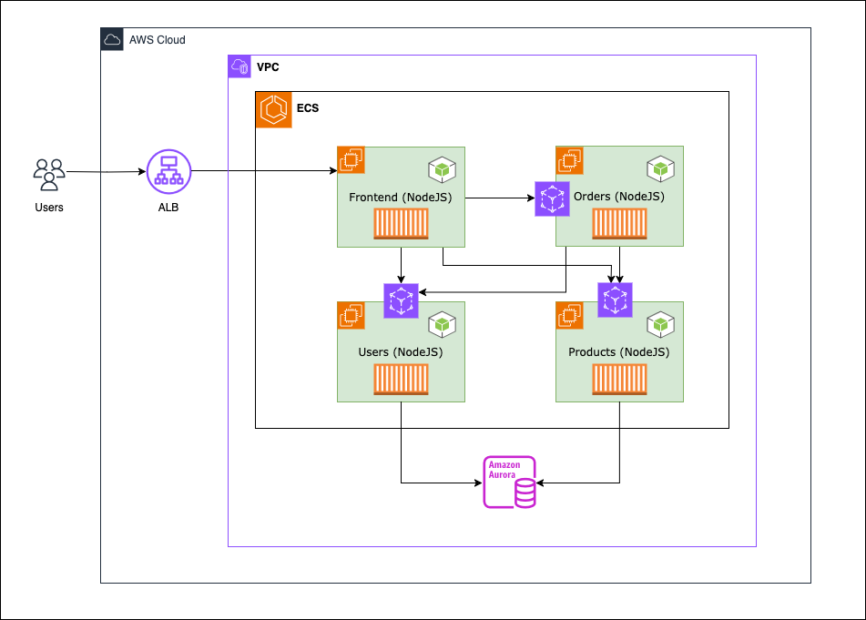

# Migration from AWS AppMesh to VPC Lattice in ECS cluster

This repository serves as an in-depth resource to help you understand and implement microservices migration strategies. While the example provided here is based on our specific use case, the principles and methodologies can be adapted to suit various microservices applications, regardless of their complexity or scale.

This application serves as our practical example throughout this guide, demonstrating real-world migration scenarios and solutions. Architecture of the application:



If you have an application already running on AWS App Mesh, you can skip the initial setup and use the following guide for [AppMesh to Lattice migration](appmesh-lattice-onboarding-files/vpc-lattice-migration-readme.md).

To run this as a hands-on workshop, continue with the step-by-step instructions below:

# Prerequisites

To get stared with this deployment there are some prerequisites to consider.

1. Amazon VPC - Use an existing VPC or create a new VPC ([AWS documentation](https://docs.aws.amazon.com/vpc/latest/userguide/create-vpc.html)) with desired CIDR block in us-west-2, with public and private subnets, with outbound internet connectivity. Note down the VPC ID, Subnet IDs, Security Group IDs, to use in different steps of the migration.

2. Amazon Aurora Serverless - Deploy a PostgreSQL database instance within VPC's private subnets using Aurora Serverless v2. Follow the detailed setup instructions in the [AWS Aurora Serverless v2 documentation](https://docs.aws.amazon.com/AmazonRDS/latest/AuroraUserGuide/aurora-serverless-v2.create.html). During the creation process, set up secure database credentials and storing them in AWS Systems Manager Parameter Store as mentioned in step 4. Once the database is provisioned, connect to it using your preferred PostgreSQL client and execute the SQL queries provided [here](schema.sql) to create the necessary table structure and load sample data. After initialization, verify that all tables are created correctly and the sample data is properly loaded. Ensure your database is properly secured by configuring appropriate security groups and VPC access controls. 

3. Amazon Elastic Container Registry repositories for the services (frontend-ui, product-ms, user-ms and order-ms).

4. AWS Systems Manager Parameter Store: Provision a SecureString parameter to store the postgresql:// connection string of the database provisioned in step 2.

5. *Latest* AWS CLI version setup with appropriate profile/session credentials.

# Migration Steps

## Build and push application container images to ECR

1. Clone the repository

```bash 
git clone [repository-url]
```

2. Authenticate with ECR

```bash
export ACCOUNT_ID=`aws sts get-caller-identity --query "Account" --output text`;
aws ecr get-login-password --region us-west-2 | \
docker login --username AWS --password-stdin $ACCOUNT_ID.dkr.ecr.us-west-2.amazonaws.com
```
   
3. Build a container image and push to ECR repo:

    a. Navigate to the microservice directory

    ```bash 
    # For Frontend UI service
    cd ecs-express-app-lattice/frontend-ms/frontend-ui
    export SERVICE_NAME=${PWD##*/}
    ```

    b. Build and push the Docker image. Note : This command uses the buildx plugin to create multi-architecture images.
       
    ```bash
    docker buildx build \
      --platform linux/amd64,linux/arm64 \
      -t $ACCOUNT_ID.dkr.ecr.us-west-2.amazonaws.com/$SERVICE_NAME:latest \
      --push .
    ```

   c. Repeat below commands for each microservice `product-ms, user-ms and order-ms`.

   ```bash
   cd ../../product-ms
   export SERVICE_NAME=product-ms
   docker buildx build \
      --platform linux/amd64,linux/arm64 \
      -t $ACCOUNT_ID.dkr.ecr.us-west-2.amazonaws.com/$SERVICE_NAME:latest \
      --push .
   ```

## App Mesh Initial Setup

1. Create a mesh in App Mesh:

```
aws appmesh create-mesh --mesh-name inventory-mesh --spec "egressFilter={type=ALLOW_ALL}" --region us-west-2
```

2. Create a namespace in AWS Cloud Map:

```
aws servicediscovery create-private-dns-namespace --name inventory-mesh.local --vpc <vpc-id> --region us-west-2
```
Note:  Wait for the namespace to be created successfully (1-2 minutes)

```
aws servicediscovery list-namespaces --filters Name=NAME,Values=inventory-mesh.local --region us-west-2
```

3. Check Route53 hosted zone created by Cloud Map service:

```
aws route53 list-hosted-zones-by-name --dns-name inventory-mesh.local
```

## Deploy App Mesh enabled backend services

Follow the steps [here](appmesh-lattice-onboarding-files/appmesh-integration-readme.md) to deploy the backend services with App Mesh.

## Deploy the Frontend UI service with ALB

Once the backend services are validated, deploy the frontend application with steps in the [doc](frontend-ms/frontend-readme.md).

## VPC Lattice migration

After validating the application end-to-end with App Mesh, migrate the backend services to VPC Lattice following steps [here](appmesh-lattice-onboarding-files/vpc-lattice-migration-readme.md).

## Clean-up

After validating the VPC Lattice migration with the Frontend UI application connecting to the Products service through VPC Lattice, clean-up the resources deployed in this guide (and any other pre-requisites if you no longer need them), following steps [here](appmesh-lattice-onboarding-files/clean-up-readme.md).

## Acknowledgments

We would like to thank the following individuals for their valuable contributions, testing, and recommendations that helped improve this migration guide:

- **Justin Haydt**, *[AWS solutions Architect]* - Testing and validation of migration scenarios
- **Henrique Santana**, *[Principal Cloud Support Engineer]* - Architecture recommendations and best practices
- **Hardeep Singh Tiwana**, *[Sr Technical Account Manager]* - Validations and optimization suggestions
