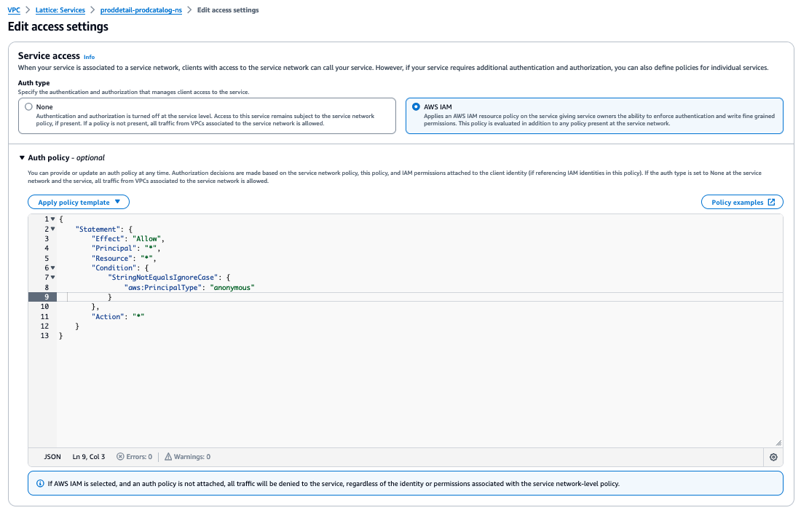

# Securing the network and implementing AWS IAM authentication with Amazon VPC Lattice and Amazon EKS

For the purpose of this blog and to demostrate IAM authentication, we apply auth policy on `proddetail-prodcatalog-ns` service. In case your application demands more granular policies, please refer to the [auth policies documentation](https://docs.aws.amazon.com/vpc-lattice/latest/ug/auth-policies.html).

You can start with blocking all the traffic to the service.
For the service `proddetail-prodcatalog-ns` under **Amazon VPC Lattice**, click on the **service** and go **Access** Tab. Click on **Edit access settings**, in the subsequent screen select **AWS IAM**, then **select Apply policy template** > **Allow only authenticated access**. Then choose **Save** changes.



Now lets try accessing the service from prodcatag pod.

```bash
kubectl exec prodcatalog-997fd7778-mz7v8 -c prodcatalog -it sh
curl proddetail-prodcatalog-ns-0b13d4b53748cbdc7.7d67968.vpc-lattice-svcs.us-west-2.on.aws/catalogdetail
AccessDeniedException: User: arn:aws:sts::xxxxxxx:assumed-role/eksctl-App-Mesh-Lattice-blog-addon-iamservice-Role1-yz1hNJittmXj/1726632845600682009 is not authorized to perform: vpc-lattice-svcs:Invoke on resource: arn:aws:vpc-lattice:us-west-2:xxxxxxx:service/svc-0b13d4b53748cbdc7/catalogdetail because no identity-based policy allows the vpc-lattice-svcs:Invoke action#

```
The above test indicates that the service requires AWS IAM Authentication, otherwise it returns HTTP 403 forbbidden error.
Lets assume that as per the business requirement only product catalog deployment should be able to access product details. In order to acheive this, we should prepare the product catalog deployment.

To begin, Identify the role associated with the service account used by the prod catalog deployment.

```bash
kubectl get deployment prodcatalog -o jsonpath='{.spec.template.spec.serviceAccountName}' | xargs -I {} kubectl get serviceaccount {} -o jsonpath='{.metadata.annotations.eks\.amazonaws\.com/role-arn}'
```

Once the IAM role is identified, attach the below inline policy by updating the region, account number and the service id of Amazon VPC Lattice . You need to add the vpc-lattice-svcs:Invoke permission to this role. Here's how you can do it:

1. Open the **IAM console** in AWS.
2. Find the **role eksctl-App-Mesh-Lattice-blog-addon-iamservice-Role1-yz1hNJittmXj**
3. Add an **inline policy** or **edit an existing policy** attached to this role.

```bash
{
    "Version": "2012-10-17",
    "Statement": [
        {
            "Effect": "Allow",
            "Action": "vpc-lattice-svcs:Invoke",
            "Resource": "arn:aws:vpc-lattice:<AWS-Region>:<AWS Account number>:service/<service-id of lattice service>/*"
        }
    ]
}
```

Next ensure the Amazon VPC Lattice service's auth policy allows this role: 
The Amazon VPC Lattice  service itself needs to allow access from this role. You can do this by updating the service's auth policy:

1. Open the **Amazon VPC Lattice** console.
2. Find the **Service**.
3. Edit the **auth policy** to include below JSON

```bash
{
    "Version": "2012-10-17",
    "Statement": [
        {
            "Effect": "Allow",
            "Principal": {
                "AWS": "arn:aws:iam::xxxxxx:role/eksctl-App-Mesh-Lattice-blog-addon-iamservice-Role1-abcd"
            },
            "Action": "vpc-lattice-svcs:Invoke",
            "Resource": "*"
        }
    ]
}
```

After this is done, we are going to call our service via product catalog deployment with a proxy container. THe proxy container will listen on port 8080 and run as user 101. Now we would like to intercept traffic from the main app, use the iptables utility to route the traffic connecting to Amazon VPC Lattice CIDR 169.254.171.0/24 to EGRESS_PROXY chain, and redirect the traffic to local port 8080. The complete YAML manifest is prodcatalog-deploy-IAM.yaml present in the repository. Make sure to update the account number and the region in the above yaml.

Update the deployment

```bash
kubectl apply -f ./vpc-lattice-config/files/prodcatalog-deploy-IAM.yaml
```

Once the deployment is updated, ensure that the sidecar and init container are running. 

```bash
kubectl get pods
NAME                             READY   STATUS    RESTARTS   AGE
frontend-node-6bc58795b9-7wmtb   1/1     Running   0          5d8h
prodcatalog-997fd7778-g6cwm      2/2     Running   0          108m
proddetail-6fc8ffd649-s2f87      1/1     Running   0          5d8h
proddetail2-7567556cd5-7s8bq     1/1     Running   0          5d8h
```

Test by accessing the Amazon VPC Lattice service from prodcatalog pod.

```bash
kubectl exec prodcatalog-997fd7778-g6cwm -c prodcatalog -it sh
curl proddetail-prodcatalog-ns-0b13d4b53748cbdc7.7d67968.vpc-lattice-svcs.us-west-2.on.aws/catalogdetail
{"version":"1","vendors":["ABC.com"]}#
```

We can also verify that headers were added by the proxy

```bash
kubectl logs prodcatalog-997fd7778-2hk5t -c sigv4proxy
time="2024-09-18T07:51:23Z" level=debug msg="signed request" region=us-west-2 service=vpc-lattice-svcs
time="2024-09-18T07:51:23Z" level=debug msg="proxying request" request="GET /catalogdetail HTTP/1.1\r\nHost: proddetail-prodcatalog-ns-0b13d4b53748cbdc7.
```

The setup is complete and as per the requirement only product catalog deployment will be able to access product details and the frontend deployment will still receive HTTP 403.

Please note we have used the blog [Implement AWS IAM authentication with Amazon VPC Lattice and Amazon EKS](https://aws.amazon.com/blogs/containers/implement-aws-iam-authentication-with-amazon-vpc-lattice-and-amazon-eks/) as a reference to demostrate this functionality. 

Also consider reading [Secure Cross-Cluster Communication in EKS with Amazon VPC Lattice and Pod Identity IAM Session Tags](https://aws.amazon.com/blogs/containers/secure-cross-cluster-communication-in-eks-with-vpc-lattice-and-pod-identity-iam-session-tags/)
