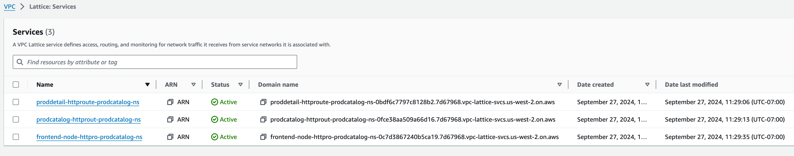
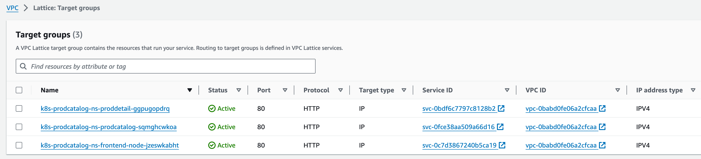
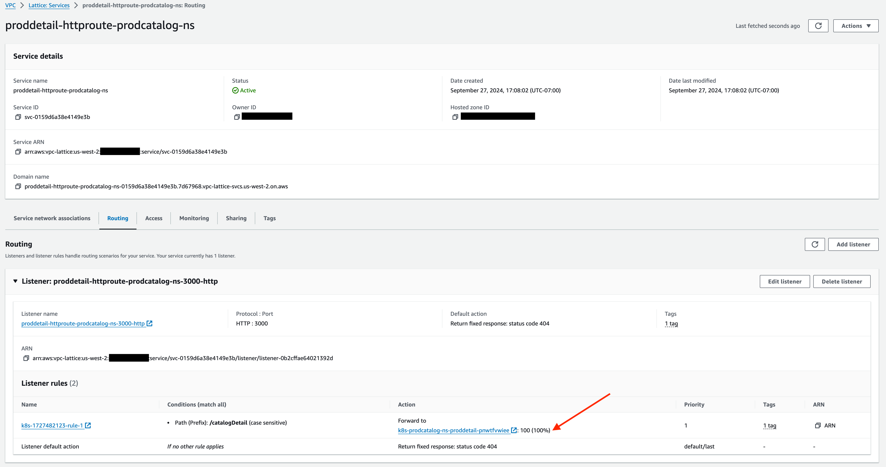
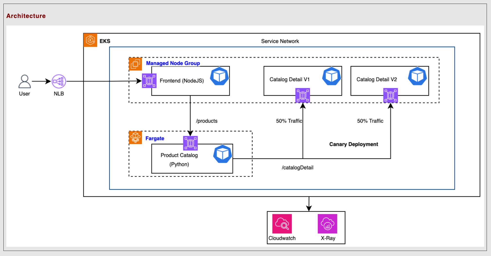
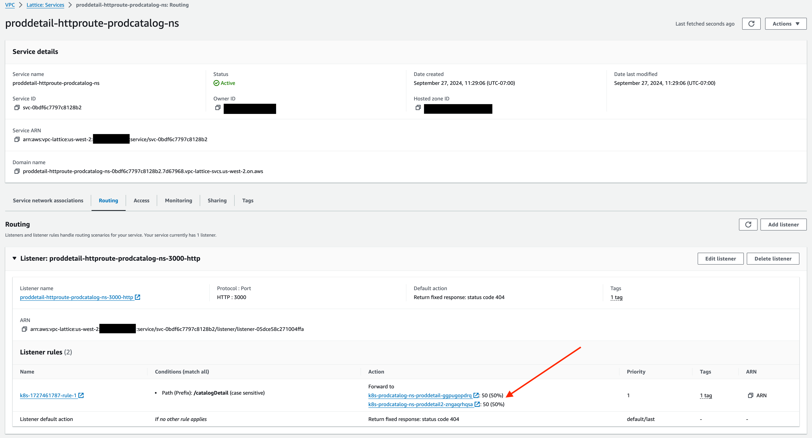

### In-Place migration steps - Replace AppMesh with Amazon VPC lattice. 

###### **Note1: These steps differ from main [README.md](README.md) file, which is focused on building a differnt namespace to deploy app.**
-------
###### **Note2: We assume you have completed the steps in [AppMesh-Install-README.md](AppMesh-Install-README.md) before proceeding.**
------
#


**Step 1: ###Optional### - Only required, if you don't already have the repositories cloned. Git clone 2 required repositories to your local workspace with following commands:**

###### *Note: We are intentionally cloning the second repository inside the first one.*
```bash
cd ~
git clone https://github.com/aws-samples/migrating-from-aws-app-mesh-to-amazon-vpc-lattice.git
cd migrating-from-aws-app-mesh-to-amazon-vpc-lattice
git clone https://github.com/aws-containers/eks-app-mesh-polyglot-demo
```

**Step 2: Check if AWS_REGION, ACCOUNT_ID and, CLUSTER_NAME are set correctly**

```bash
test -n "$AWS_REGION" && echo AWS_REGION is "$AWS_REGION" || echo AWS_REGION is not set
test -n "$ACCOUNT_ID" && echo ACCOUNT_ID is "$ACCOUNT_ID" || echo ACCOUNT_ID is not set
test -n "$CLUSTER_NAME" && echo CLUSTER_NAME is "$CLUSTER_NAME" || echo CLUSTER_NAME is not set
```

* If not, export the AWS_REGION, ACCOUNT_ID and, CLUSTER_NAME to ENV

```bash 
export ACCOUNT_ID=<your_account_id>
export AWS_REGION=<your_aws_region>
export CLUSTER_NAME=<your_eks_cluster_name>
```


**Step 3: ###Optional### - Only required, if you don't already have ECR and images. login to registery**

```bash
aws ecr get-login-password --region ${AWS_REGION} | docker login --username AWS --password-stdin ${ACCOUNT_ID}.dkr.ecr.${AWS_REGION}.amazonaws.com
```

**Step 4: ###Optional### - Only required, if you don't already have ECR and images. Create, Validate and push images to ECR.**

```bash
export PROJECT_NAME=eks-app-mesh-to-vpc-lattice
export APP_VERSION=1.0
cd eks-app-mesh-polyglot-demo
for app in catalog_detail product_catalog frontend_node; 
    do
        aws ecr describe-repositories --repository-name $PROJECT_NAME/$app >/dev/null 2>&1 || \
        aws ecr create-repository --repository-name $PROJECT_NAME/$app >/dev/null
        TARGET=${ACCOUNT_ID}.dkr.ecr.${AWS_REGION}.amazonaws.com/$PROJECT_NAME/$app:$APP_VERSION
        docker buildx build --platform linux/amd64 -t $TARGET apps/$app
        docker push $TARGET
done; cd ..
```

**Step 5: Allow traffic from Amazon VPC lattice.**

```bash
CLUSTER_SG=$(aws eks describe-cluster --name $CLUSTER_NAME --output json| jq -r '.cluster.resourcesVpcConfig.clusterSecurityGroupId')

PREFIX_LIST_ID=$(aws ec2 describe-managed-prefix-lists --query "PrefixLists[?PrefixListName=="\'com.amazonaws.$AWS_REGION.vpc-lattice\'"].PrefixListId" | jq -r '.[]')

aws ec2 authorize-security-group-ingress --group-id $CLUSTER_SG --ip-permissions "PrefixListIds=[{PrefixListId=${PREFIX_LIST_ID}}],IpProtocol=-1"

PREFIX_LIST_ID_IPV6=$(aws ec2 describe-managed-prefix-lists --query "PrefixLists[?PrefixListName=="\'com.amazonaws.$AWS_REGION.ipv6.vpc-lattice\'"].PrefixListId" | jq -r '.[]')

aws ec2 authorize-security-group-ingress --group-id $CLUSTER_SG --ip-permissions "PrefixListIds=[{PrefixListId=${PREFIX_LIST_ID_IPV6}}],IpProtocol=-1"
```

**Setp 6: Setup IAM policy for Amazon VPC lattice Controller**

```bash
curl https://raw.githubusercontent.com/aws/aws-application-networking-k8s/main/files/controller-installation/recommended-inline-policy.json  -o vpc-lattice-config/files/recommended-inline-policy.json

aws iam create-policy \
   --policy-name VPCLatticeControllerIAMPolicy \
   --policy-document file://vpc-lattice-config/files/recommended-inline-policy.json

export VPCLatticeControllerIAMPolicyArn=$(aws iam list-policies --query 'Policies[?PolicyName==`VPCLatticeControllerIAMPolicy`].Arn' --output text)
```

**Step 7: Create a Namespace named aws-application-networking-system. it comes with label control-plane: gateway-api-controller**

```bash
kubectl get ns |grep -q ^aws-application-networking-system || kubectl apply -f https://raw.githubusercontent.com/aws/aws-application-networking-k8s/main/files/controller-installation/deploy-namesystem.yaml
```

**Step 8: [Set up the Amazon EKS Pod Identity Agent](https://docs.aws.amazon.com/eks/latest/userguide/pod-id-agent-setup.html). Confirm that the EKS Pod Identity Agent pods are running on your cluster.**

```bash
aws eks create-addon --cluster-name $CLUSTER_NAME --addon-name eks-pod-identity-agent
sleep 30
kubectl get pods -n kube-system | grep 'eks-pod-identity-agent'
```

**Step 9: Service account for PodIdentity to be used by gateway-api-controller-service-account.**

```bash
kubectl apply -f ./vpc-lattice-config/files/gateway-api-controller-service-account.yaml
```

**Step 10: setup variables to use in commands**
```bash
export oldns_name=prodcatalog-ns
export newns_name=prodcatalog-ns-lattice
alias oldns_cmd='sed "s/$newns_name/$oldns_name/g"'
```

**Step 11: Use old namespace to create service account to use in pods**

```bash
echo 'takeing backup if you need to reference it later'
kubectl get ns $oldns_name -o yaml > $oldns_name.backup.yaml 
oldns_cmd ./vpc-lattice-config/files/lattice-pod-service-account.yaml|envsubst|kubectl apply -f -
```

**Step 12: Create a role with trust relationship policy for Amazon VPC lattice Controller.**

```bash
aws iam create-role --role-name VPCLatticeControllerIAMRole \
   --assume-role-policy-document file://vpc-lattice-config/files/trust-relationship.json \
   --description "IAM Role for AWS Gateway API Controller for Amazon VPC lattice"

export VPCLatticeControllerIAMRoleArn=$(aws iam list-roles --query 'Roles[?RoleName==`VPCLatticeControllerIAMRole`].Arn' --output text)

export VPCLatticeControllerIAMPolicyArn=$(aws iam list-policies --query 'Policies[?PolicyName==`VPCLatticeControllerIAMPolicy`].Arn' --output text)

aws iam attach-role-policy --role-name VPCLatticeControllerIAMRole --policy-arn=$VPCLatticeControllerIAMPolicyArn
```

**Step 13: Create a role with trust relationship policy for Service Account to use in PODs.**

```bash
aws iam create-policy --policy-name VPCLatticeIAMPolicyForProdcatalog \
    --policy-document file://vpc-lattice-config/files/lattice-pod-service-account-policy.yaml

aws iam create-role --role-name VPCLatticeIAMRoleForProdcatalog \
    --assume-role-policy-document file://vpc-lattice-config/files/trust-relationship.json \
    --description "IAM Role for service account prodcatalog-lattice-sa"

export VPCLatticeIAMPolicyForProdcatalogArn=$(aws iam list-policies --query 'Policies[?PolicyName==`VPCLatticeIAMPolicyForProdcatalog`].Arn' --output text)

aws iam attach-role-policy --role-name VPCLatticeIAMRoleForProdcatalog --policy-arn=$VPCLatticeIAMPolicyForProdcatalogArn

export VPCLatticeProdcatalogIAMRoleArn=$(aws iam list-roles --query 'Roles[?RoleName==`VPCLatticeIAMRoleForProdcatalog`].Arn' --output text)
```

**Step 14: Create the pod identity association with Amazon VPC lattice Controller Service Account.**

```bash
aws eks create-pod-identity-association --cluster-name $CLUSTER_NAME --role-arn $VPCLatticeControllerIAMRoleArn --namespace aws-application-networking-system --service-account gateway-api-controller
```

**Step 15: use old namespace to create pod identity association**

```bash
aws eks create-pod-identity-association --cluster-name $CLUSTER_NAME --role-arn $VPCLatticeProdcatalogIAMRoleArn --namespace $oldns_name --service-account prodcatalog-lattice-sa
```

**Step 16: Login to get helm chat from ECR and install gateway controller.**

```bash
aws ecr-public get-login-password --region $AWS_REGION | helm registry login --username AWS --password-stdin public.ecr.aws

# set lacttice controller version
export LATTICE_CONTROLLER_VERSION=1.0.6
export defaultServiceNetwork=product-catalog-lattice-gw

# install gateway controller
helm install gateway-api-controller \
    oci://public.ecr.aws/aws-application-networking-k8s/aws-gateway-controller-chart \
    --version=v${LATTICE_CONTROLLER_VERSION} \
    --set=aws.region=${AWS_REGION} \
    --set serviceAccount.annotations."eks\.amazonaws\.com/role-arn"="$VPCLatticeControllerIAMRoleArn" \
    --set=defaultServiceNetwork=${defaultServiceNetwork} \
    --namespace aws-application-networking-system \
    --wait
```

**Step 17: Check the status of the pods for lattice gateway-api-controller**

```bash
kubectl --namespace aws-application-networking-system get pods -l "app.kubernetes.io/instance=gateway-api-controller"
```

**Step 18: Create the `amazon-vpc-lattice` GatewayClass**

```bash
kubectl apply -f https://raw.githubusercontent.com/aws/aws-application-networking-k8s/main/files/controller-installation/gatewayclass.yaml
```

**Step 19: use old namespace name to create gateway**

```bash
oldns_cmd ./vpc-lattice-config/files/product-catalog-gateway.yaml|envsubst|kubectl apply -f -
kubectl wait --for=condition=Programmed gateway/product-catalog-lattice-gw -n $oldns_name
kubectl get gateway -n $oldns_name
kubectl get gateway -n $oldns_name -o jsonpath='{"Status: "}{.items[*].status.conditions[1].reason}{", "}{"Reason_or_DNS_Name: "}{.items[*].status.conditions[1].message}{"\n"}'
```

**Step 20: use old namespace name to Create TargetGroupPolicy and HTTPRoute**

```bash
for file in proddetail-TargetGroupPolicy-proddetail-v1 prodcatalog-TargetGroupPolicy frontend-node-TargetGroupPolicy proddetail-HTTPRoute prodcatalog-HTTPRoute frontend-node-HTTPRoute
  do
	oldns_cmd ./vpc-lattice-config/files/$file.yaml |envsubst |kubectl apply -f -
done
```
You can view services created by HTTPRoutes in VPC Lattice -> Services page.


You can view TargetGroupPolicy in action under VPC Lattice -> Target Groups page.


Check in UI, click on service, select 'proddetail-httproute-prodcatalog-ns' click on 'routing', and finally click on 'Listener: proddetail-httproute-prodcatalog-ns-3000-http' to see the canary setup under "Forward to" section.


**Step 21: use old namespace name to test connectivity using Amazon VPC lattice endpoints.**
###### *Note: It will fail because of ### Known issue https://github.com/istio/istio/issues/2833 ### Envoy 404 when receiving request with unknown hostname*

```bash
echo 'Waiting to let VPC Lattice service assign domain names to our httproutes'

kubectl  wait httproute proddetail-httproute -n $oldns_name --for=jsonpath='{.metadata.annotations.application-networking\.k8s\.aws/lattice-assigned-domain-name}' --timeout=300s

export GET_PRODDETAIL_URL=$(kubectl get -n $oldns_name httproute proddetail-httproute -o jsonpath='{.metadata.annotations.application-networking\.k8s\.aws/lattice-assigned-domain-name}')

# find the pod name in 'prodcatalog'
export GET_CATALOG_POD_NAME=$(kubectl get pods -n $oldns_name -l app=prodcatalog -o jsonpath='{.items[].metadata.name}')

# try connecting from 'prodcatalog' to 'proddetail', use output from prvious command to replace 'GET_PRODDETAIL_URL'
alias exit_code_catalog_to_proddetail='kubectl -n $oldns_name exec -it $GET_CATALOG_POD_NAME -c prodcatalog -- curl -o /dev/null -s -w "%{http_code}\n" $GET_PRODDETAIL_URL:3000/catalogDetail'
export CHECK_CONN_CATALOG_TO_PRODDETAIL=$(echo "kubectl -n $oldns_name exec -it ${GET_CATALOG_POD_NAME} -c prodcatalog -- curl ${GET_PRODDETAIL_URL}:3000/catalogDetail")
export CHECK_CONN_CATALOG_TO_PRODDETAIL_jq=$(echo "kubectl -n $oldns_name exec -it ${GET_CATALOG_POD_NAME} -c prodcatalog -- curl ${GET_PRODDETAIL_URL}:3000/catalogDetail 2>&1|jq -s") 
echo 'Waiting to let VPC Lattice service assign domain names to our httproutes'
# Find URL for "prodcatalog" service created by httproute
kubectl  wait httproute prodcatalog-httproute -n $oldns_name --for=jsonpath='{.metadata.annotations.application-networking\.k8s\.aws/lattice-assigned-domain-name}' --timeout=300s

export GET_CATALOG_URL=$(kubectl get -n $oldns_name httproute prodcatalog-httproute -o jsonpath='{.metadata.annotations.application-networking\.k8s\.aws/lattice-assigned-domain-name}')

# get inside "frontend-node" container and see if it can get data "prodcatalog" AppMesh service
export GET_FRONTEND_POD_NAME=$(kubectl get pods -n $oldns_name -l app=frontend-node -o jsonpath='{.items[].metadata.name}')

# try connecting from 'frontend-node' to 'prodcatalog', use output from prvious command to replace 'GET_CATALOG_URL'
alias exit_code_frontend_to_catalog='kubectl -n $oldns_name exec -it ${GET_FRONTEND_POD_NAME} -c frontend-node -- curl -o /dev/null -s -w "%{http_code}\n" ${GET_CATALOG_URL}:5000/products/'
export CHECK_CONN_FRONTEND_TO_CATALOG=$(echo "kubectl -n $oldns_name exec -it ${GET_FRONTEND_POD_NAME} -c frontend-node -- curl ${GET_CATALOG_URL}:5000/products/") 
export CHECK_CONN_FRONTEND_TO_CATALOG_jq=$(echo "kubectl -n $oldns_name exec -it ${GET_FRONTEND_POD_NAME} -c frontend-node -- curl ${GET_CATALOG_URL}:5000/products/ 2>&1|jq -s") 
```

**Step 22: use old namespace name to test connectivity using Amazon VPC lattice endpoints `exit code 404` is expected. Validate you have GET_CATALOG_URL and GET_PRODDETAIL_URL variables set. if not, please follow Step 21**


###### *Note: First, we will retrieve the VPC Lattice URL for the proddetail service. Next, we exec into the prodcatalog pod and attempt to connect to the proddetail VPC Lattice URL. At this stage, we expect this curl command to return a 404. It will fail because of ### Known issue https://github.com/istio/istio/issues/2833 ### Envoy 404 when receiving request with unknown hostname.*

```bash
if [ -z $GET_CATALOG_URL ] ||  [[ -z $GET_PRODDETAIL_URL ]]; then
    test -n "$GET_CATALOG_URL" && echo GET_CATALOG_URL is "$GET_CATALOG_URL" || echo GET_CATALOG_URL is not set
    test -n "$GET_PRODDETAIL_URL" && echo GET_PRODDETAIL_URL is "$GET_PRODDETAIL_URL" || echo GET_PRODDETAIL_URL is not set
    test -n "$AWS_REGION" && echo AWS_REGION is "$AWS_REGION" || echo AWS_REGION is not set
    test -n "$ACCOUNT_ID" && echo ACCOUNT_ID is "$ACCOUNT_ID" || echo ACCOUNT_ID is not set
    echo -e "Please set the variables as shown in Step 21 and re-try \n"
else
    echo "executing the command to test connection from 'prodcatalog' to 'proddetail' using Amazon VPC lattice endponts."; echo
    echo $CHECK_CONN_CATALOG_TO_PRODDETAIL;
    eval $CHECK_CONN_CATALOG_TO_PRODDETAIL;
    echo -e "\n-----------------------------------------------\n"
    echo "executing the command to test connection from 'frontend-node' to 'prodcatalog' using Amazon VPC lattice endponts."; echo
    echo $CHECK_CONN_FRONTEND_TO_CATALOG
    eval $CHECK_CONN_FRONTEND_TO_CATALOG
    echo -e "\n-----------------------------------------------\n"
    echo "compare both outputs"
    echo $CHECK_CONN_FRONTEND_TO_CATALOG
    eval $CHECK_CONN_FRONTEND_TO_CATALOG; echo -e '-----------\n';
    echo $CHECK_CONN_CATALOG_TO_PRODDETAIL
    eval $CHECK_CONN_CATALOG_TO_PRODDETAIL
    echo -e "\n-----------------------------------------------\n"
    echo -en "exit code for CHECK_CONN_CATALOG_TO_PRODDETAIL : "
    exit_code_catalog_to_proddetail
    echo -e "\n-----------------------------------------------\n"
    echo -en "exit code for CHECK_CONN_FRONTEND_TO_CATALOG : "
    exit_code_frontend_to_catalog
fi
```
Check the command outputs

```bash
echo "executing '$CHECK_CONN_FRONTEND_TO_CATALOG_jq'"
sleep 2
eval $CHECK_CONN_FRONTEND_TO_CATALOG_jq
echo -en "\nexit code for CHECK_CONN_FRONTEND_TO_CATALOG : "
exit_code_frontend_to_catalog
echo -e "\n-----------------------------------------------\n"
sleep 2
echo "executing '$CHECK_CONN_CATALOG_TO_PRODDETAIL_jq'"
sleep 2
eval $CHECK_CONN_CATALOG_TO_PRODDETAIL_jq
echo -en "exit code for CHECK_CONN_CATALOG_TO_PRODDETAIL : "
exit_code_catalog_to_proddetail
```
#### **Service Impact**: - because we need to remove flag on namespace to remove App Mesh sidecar injection ####

**Step 23: configure application to work using Amazon VPC lattice endponts.**
    **Disable appmesh injection using namespace.** 
    `appmesh.k8s.aws/sidecarInjectorWebhook: enabled`: The sidecar injector will inject the sidecar into pods by default. Add the `appmesh.k8s.aws/sidecarInjectorWebhook` lable with value `disabled` to the namespace labels to override the default and disable injection. [see documentation here](https://aws.github.io/aws-app-mesh-controller-for-k8s/reference/injector/)

``` bash
kubectl get ns $oldns_name -o yaml|tee -a $oldns_name.backup.yaml
kubectl label ns $oldns_name --overwrite {mesh-,gateway-,appmesh.k8s.aws/sidecarInjectorWebhook-}
echo -e '------------After changes-------------\n'
kubectl get ns $oldns_name -o yaml
```

**Step 24:rolling restart the deployments.**

```bash
for app in prodcatalog proddetail frontend-node proddetail2
  do
	kubectl -n $oldns_name rollout restart deployment $app
done
```

**Step 25: validate the containers in the pods, give it a min to clean up the old pods**

```bash
echo "Let old pods to termintate and new pods spin up"

echo 'Wait for Fargate pod "prodcatalog" to get in "Ready" state'

kubectl wait -n prodcatalog-ns --for='jsonpath={.status.conditions[?(@.type=="Ready")].status}=True' -l app=prodcatalog pod --timeout=300s

kubectl -n $oldns_name get pods -o 'custom-columns=POD:.metadata.name,CONTAINER:.spec.containers[*].name' |egrep -i 'prodcatalog|proddetail|frontend-node|proddetail2'

kubectl -n $oldns_name get pods
```

**Step 26: test connectivity again using Step 21 and 22 and using these commands, you should get now get `exit code 200`**
Get inside **"frontend-node"** container and see if it can get data **"prodcatalog"** AppMesh service

```bash
kubectl -n $oldns_name exec -it `kubectl get pods -n $oldns_name -l app=frontend-node -o jsonpath='{.items[].metadata.name}'` -c frontend-node -- curl http://prodcatalog.prodcatalog-ns.svc.cluster.local:5000/products/ 2>&1|jq -s
```

Get inside **"prodcatalog"** container and see if it can get data from **"proddetail"** AppMesh service

```bash
kubectl -n $oldns_name exec -it `kubectl get pods -n $oldns_name -l app=prodcatalog -o jsonpath='{.items[].metadata.name}'` -c prodcatalog -- curl http://proddetail.prodcatalog-ns.svc.cluster.local:3000/catalogDetail 2>&1|jq -s
```

**Step 27: Validate the files and endpoints**

```bash
echo $GET_CATALOG_URL
echo $GET_PRODDETAIL_URL
grep -n svc.cluster.local ./eks-app-mesh-polyglot-demo/deployment/base_app.yaml
echo -e "\nPlease validate make sure new URLs (shown below) are correct\n"
oldns_cmd ./eks-app-mesh-polyglot-demo/deployment/base_app.yaml |sed -e "s/prodcatalog.prodcatalog-ns.svc.cluster.local/$GET_CATALOG_URL/g" -e "s/proddetail.prodcatalog-ns.svc.cluster.local/$GET_PRODDETAIL_URL/g" -e "s/eks-app-mesh-demo\//$PROJECT_NAME\//g" -e "s/eks-app-mesh-demo/$oldns_name/g"|envsubst |egrep -n ':5000/products/|:3000/catalogDetail'
```

**Step 28: update apps to use Amazon VPC lattice endpoints AND New Service Account `prodcatalog-lattice-sa`. Finally apply the changes**

```bash
export OLD_SA=prodcatalog-envoy-proxies
export NEW_SA=prodcatalog-lattice-sa
alias sed_transform='sed -e "s/prodcatalog.prodcatalog-ns.svc.cluster.local/$GET_CATALOG_URL/g" -e "s/proddetail.prodcatalog-ns.svc.cluster.local/$GET_PRODDETAIL_URL/g" -e "s/eks-app-mesh-demo\//$PROJECT_NAME\//g" -e "s/eks-app-mesh-demo/$oldns_name/g" -e "s/$OLD_SA/$NEW_SA/g"'

oldns_cmd ./eks-app-mesh-polyglot-demo/deployment/base_app.yaml | sed_transform|envsubst|kubectl apply -f -

kubectl -n $oldns_name get pods

echo "Let old pods to termintate and new pods spin up"

echo 'Wait for Fargate pod "prodcatalog" to get in "Ready" state'

kubectl wait -n prodcatalog-ns --for='jsonpath={.status.conditions[?(@.type=="Ready")].status}=True' -l app=prodcatalog pod --timeout=300s
```

**Step 29: Validate your application is working as expected using VPC Lattice URLs**
+ Re-Run step 21 and Step 22 from this reame file. This time you should see connections work using VPC Lattice URLs.

**Step 30: reconfigure the ingress load balancer to point to front-end service port**

```bash
#kubectl -n $oldns_name edit service/ingress-gw
# set targetPort to 9000 and selector app to 'frontend-node'
# targetPort: 9000
#  selector:
#    app: frontend-node
kubectl -n $oldns_name get service/ingress-gw -o yaml |sed -e 's/8088/9000/g' -e "s/app:.*/app: frontend-node/"|kubectl apply -f -

```
Output of below given command should be **`"9000,frontend-node"`**

```bash
kubectl -n $oldns_name get service/ingress-gw -o jsonpath='{.spec.ports[0].targetPort},{.spec.selector.app}'
```

Try accessing the application using Ingress LB URL.
###### *Please ignore the "AppMesh" listed in Architecture image on GUI. This "Static" image came from 'polyglot demo' application, it is not "Dynamic".*
```bash
echo "URL: http://$(kubectl -n $oldns_name get service/ingress-gw -o jsonpath='{.status.loadBalancer.ingress[0].hostname}')"
```

**Step 31: login to registery. Create, Validate and push catalog_detail v2 image to ECR**
```bash
aws ecr get-login-password --region ${AWS_REGION} | docker login --username AWS --password-stdin ${ACCOUNT_ID}.dkr.ecr.${AWS_REGION}.amazonaws.com
PROJECT_NAME=eks-app-mesh-to-vpc-lattice
export APP_VERSION_2=2.0
cd eks-app-mesh-polyglot-demo
for app in catalog_detail; 
  do
    aws ecr describe-repositories --repository-name $PROJECT_NAME/$app >/dev/null 2>&1 || \
    aws ecr create-repository --repository-name $PROJECT_NAME/$app >/dev/null
    TARGET=$ACCOUNT_ID.dkr.ecr.$AWS_REGION.amazonaws.com/$PROJECT_NAME/$app:$APP_VERSION_2
    cd apps/$app
    docker buildx build --platform linux/amd64 -t $TARGET -f version2/Dockerfile .
    docker push $TARGET
done
cd ../../..
```

**Step 32: Deploy v2 of the app, Create a TargetGroupPolicy and HTTPRoutes to distributes 50% traffic to proddetail_v1 and 50% to proddetail_v2**

```bash
oldns_cmd ./vpc-lattice-config/files/canary.yaml|envsubst|kubectl apply -f -
```

**Step 33: Let's update "Static" image came from 'polyglot demo' application".**
Let's rebuild our Frontend container to show updated architecture image with VPC Lattice
*~ pardon ugly cat and mv, MacOS and linux sed compatibility limitations forced to do it~*
```bash
export PROJECT_NAME=eks-app-mesh-to-vpc-lattice
export APP_VERSION=1.0
app=frontend_node

aws ecr get-login-password --region ${AWS_REGION} | docker login --username AWS --password-stdin ${ACCOUNT_ID}.dkr.ecr.${AWS_REGION}.amazonaws.com

cp vpc-lattice-config/images/polyglot-lattice-architecture.png eks-app-mesh-polyglot-demo/apps/frontend_node/public/architecture2.png
cat eks-app-mesh-polyglot-demo/apps/frontend_node/views/index.ejs|sed 's/architecture.png/architecture2.png/g' > eks-app-mesh-polyglot-demo/apps/frontend_node/views/index.ejs1
mv eks-app-mesh-polyglot-demo/apps/frontend_node/views/index.ejs1 eks-app-mesh-polyglot-demo/apps/frontend_node/views/index.ejs

cd eks-app-mesh-polyglot-demo
TARGET=${ACCOUNT_ID}.dkr.ecr.${AWS_REGION}.amazonaws.com/$PROJECT_NAME/$app:$APP_VERSION
docker buildx build --platform linux/amd64 -t $TARGET apps/$app
docker push $TARGET
cd ..

kubectl -n $oldns_name rollout restart deployment frontend-node
```
Try accessing the application using Ingress LB URL, it should show you 2 versions if you click on "Canary Deployment" button in UI.

```bash
echo "URL: http://$(kubectl -n $oldns_name get service/ingress-gw -o jsonpath='{.status.loadBalancer.ingress[0].hostname}')"
```
You should now see updated architecture with VPC Lattice.


Check in UI, click on **Service**, select **'proddetail-httproute-prodcatalog-ns'** click on **'routing'**, and finally click on **'Listener: proddetail-httproute-prodcatalog-ns-3000-http'** to see the canary setup under **"Forward to"** section.



**Step 34: AppMesh Cleanup: delete all the appmesh related compoments**
```bash
for appmesh_svc in `kubectl get all -n $oldns_name |awk '/appmesh/ {print $1}'`
  do
    kubectl -n $oldns_name delete $appmesh_svc --wait=0
done

kubectl -n $oldns_name delete deployment.apps/ingress-gw

kubectl delete meshes prodcatalog-mesh --wait=0

ProdEnvoyNamespaceIAMPolicyArn=arn:aws:iam::$ACCOUNT_ID:policy/ProdEnvoyNamespaceIAMPolicy

AWSAppMeshK8sControllerIAMPolicyArn=arn:aws:iam::$ACCOUNT_ID:policy/AWSAppMeshK8sControllerIAMPolicy

aws iam list-entities-for-policy --policy-arn $ProdEnvoyNamespaceIAMPolicyArn --query 'PolicyRoles[*].RoleName' --output text | xargs -n1 aws iam detach-role-policy --policy-arn $ProdEnvoyNamespaceIAMPolicyArn --role-name

aws iam list-entities-for-policy --policy-arn $AWSAppMeshK8sControllerIAMPolicyArn --query 'PolicyRoles[*].RoleName' --output text | xargs -n1 aws iam detach-role-policy --policy-arn $AWSAppMeshK8sControllerIAMPolicyArn --role-name

aws iam delete-policy --policy-arn $ProdEnvoyNamespaceIAMPolicyArn

aws iam delete-policy --policy-arn $AWSAppMeshK8sControllerIAMPolicyArn

eksctl delete iamserviceaccount --cluster ${CLUSTER_NAME}  --name appmesh-controller
```
-------
**Step 35: Cleanup for EKS infrastructure.**
Once you have a solid understanding of the process and are satisfied with your testing on the EKS cluster created as part of the [AppMesh-Install-README.md](AppMesh-Install-README.md) steps, be sure to delete the resources to avoid future charges. You can do this by executing the following comamnd:

```bash
bash vpc-lattice-config/files/latticeblogcleanup.sh
```

Please visit VPC Lattice console and cleanup anyting leftover e.g. any leftover "Target Groups" and "Service Networks".

### Conclusion:
+ By following the steps outlined in this guide, you can seamlessly transition your microservices architecture while maintaining service reliability and improving operational efficiency. 
+ Migrating from AWS App Mesh to Amazon VPC Lattice provides a robust solution for managing application networking at scale, offering enhanced connectivity, load balancing, and security features. 
+ Be sure to explore the repository for more advanced use cases mentioned in [README.md](../README.md)
+ Remember to clean up any resources once you're done testing to avoid unnecessary charges.
+ Please refer back to the blog using [this](link_to_be_added_here) link.
